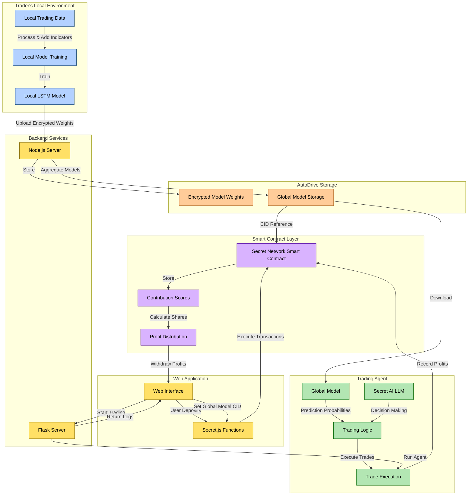

# 🔥 Conflux-AI: Privacy-Preserving Collaborative AI Trading Platform

Conflux-AI harnesses Secret Network, Secret AI, and Autonomys AutoDrive to enable crypto traders to collaboratively train private ML models and drive autonomous trading with transparent profit sharing — ensuring your data stays private while you benefit from collective intelligence.

## ⚠️ The Problem We're Solving

- **Data Privacy & Competitive Security**: Traders risk exposing proprietary strategies when using centralized AI platforms, jeopardizing their competitive edge.
- **Access to Advanced AI**: Sophisticated AI trading tools are often exclusive to institutions, leaving solo traders without the resources to leverage cutting-edge models.
- **Inefficient Collaborative Model Development**:
Without secure, decentralized aggregation, traders can’t combine insights to build stronger AI models, limiting predictive accuracy.

## 🤖 The Conflux-AI Solution

Conflux-AI merges decentralized confidential computing, autonomous AI agents, and transparent profit-sharing into a secure, collaborative trading ecosystem:

- **Privacy-Preserving AI**: Powered by Secret AI for confidential trading, ensuring sensitive data remains private while AI models operate securely and privately.
- **Permanent Decentralized Storage**: Autonomys AutoDrive encrypts and stores AI model updates, aggregating local model weights into a global AI model without relying on centralized servers.
- **On-Chain Profit Distribution**: Secret Network smart contracts calculate and distribute trading profits based on each trader’s contribution to the global model’s accuracy.

## 🔍 How Conflux-AI Works

### 1. **Local Model Training & Upload**:

Each trader trains a local LSTM model using their historical trading data, enriched with 20+ technical indicators (RSI, MACD, Bollinger Bands, etc.). Raw data never leaves the trader’s device — only encrypted model weights are uploaded securely to AutoDrive.

### 2. **Global Model Aggregation**:

The encrypted local model weights are permanently stored on AutoDrive and periodically aggregated using federated averaging. This combines the strategies of all participants into a robust global model. Each trader’s contribution to the model’s accuracy directly impacts their share of profits.

### 3. **Autonomous AI Trading Agent**:

An AI agent powered by Secret AI’s LLM retrieves the latest global model, processes live market data, and generates trade decisions in natural language — deciding when to "buy," "sell," or "hold". It autonomously executes trades and updates each trader's portfolio daily.

### 4. **Profit Distribution**:

Secret Network smart contracts transparently distribute trading profits. Each trader’s earnings are proportional to their contribution score — reflecting how much their local model improved the global AI model.

## 🔒 Why Conflux-AI is a Game Changer

- **Privacy-First**: Your data never leaves your system. Only encrypted model parameters are shared, safeguarding your trading strategies.
- **Collaborative Intelligence**: By pooling insights from diverse strategies, the global model generates more accurate predictions than any individual approach.
- **Decentralized & Trustless**: Leveraging Secret Network and AutoDrive, every transaction — from model aggregation to profit distribution — is secure, permanent, and tamper-proof.
- **Accessible for All**: Conflux-AI democratizes advanced AI trading, giving solo traders access to institutional-grade technology and ensuring fair profit sharing.

## 🏛️ Architecture

## 🚀 TL;DR

Conflux-AI empowers crypto traders to collaboratively train decentralized, private machine learning models that drive autonomous trading — without ever exposing your sensitive data.
