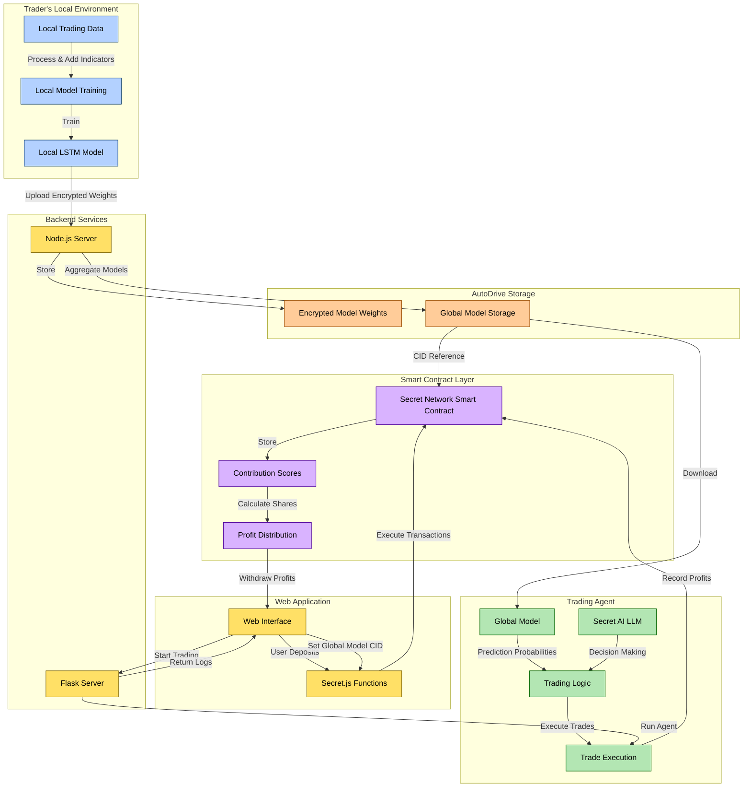

# 🔥 Conflux-AI: Privacy-Preserving Collaborative AI Trading Platform

Conflux-AI harnesses Secret Network, Secret AI, and Autonomys AutoDrive to enable crypto traders to collaboratively train private ML models and drive autonomous trading with transparent profit sharing — ensuring your data stays private while you benefit from collective intelligence.

## 📊 User-Focused Summary

Conflux-AI allows crypto traders to collaborate on building powerful AI trading models without ever exposing their proprietary strategies or data. As a trader, you simply train a model locally on your own machine, then share only the encrypted model weights (not your data) to contribute to a global AI trading system. The platform's autonomous AI agent uses this collective intelligence to execute trades, and profits are distributed fairly based on how much your model improved the global system's performance.

With Conflux-AI, you maintain complete privacy while gaining access to the combined trading intelligence of the entire network. The platform handles everything from secure model aggregation to autonomous trading and transparent profit distribution—all without requiring you to reveal your trading secrets or strategies.

## 💼 Investor Pitch

### The Problem

The cryptocurrency trading market faces three critical challenges:

1. **Data Privacy Dilemma**: Sophisticated traders with valuable strategies are reluctant to participate in collaborative AI systems because doing so typically requires exposing proprietary data and trading algorithms.

2. **Accessibility Gap**: Advanced AI trading tools remain largely inaccessible to individual traders, creating an uneven playing field dominated by institutional players with vast resources.

3. **Inefficient Knowledge Sharing**: Without a secure way to combine trading insights, the market suffers from siloed intelligence, limiting the potential accuracy and robustness of trading models.

### Market Opportunity

The cryptocurrency trading market is massive and growing, with daily trading volumes exceeding $100 billion. AI-powered trading is rapidly gaining traction, with an estimated 80% of trading volume on traditional exchanges already driven by algorithms. However, the intersection of privacy-preserving technology and collaborative AI in trading remains largely untapped.

Conflux-AI targets the growing segment of data-conscious crypto traders who want the benefits of collaborative AI without the risks of exposing their strategies. This includes both individual traders seeking institutional-grade tools and trading firms looking to enhance their models while maintaining competitive secrecy.

### Our Solution

Conflux-AI solves these challenges through a unique combination of:

- **Privacy-Preserving Federated Learning**: Enables collaboration without data sharing
- **Decentralized Secure Storage**: Ensures model weights remain encrypted and tamper-proof
- **Autonomous AI Trading**: Leverages collective intelligence for optimal trading decisions
- **Smart Contract-Based Profit Distribution**: Rewards contributors fairly based on model improvement

By addressing both the privacy concerns and accessibility barriers in AI trading, Conflux-AI creates a new paradigm where traders can benefit from collective intelligence without compromising their competitive edge.

## 🔧 Development Deep Dive

### Technical Architecture

Conflux-AI's architecture consists of five key components that work together to enable privacy-preserving collaborative AI trading:

#### 1. Local Training Environment

The trader's local environment is where all sensitive data remains. The system uses Python-based components ([`main.py`](https://github.com/capGoblin/conflux-ai/blob/main/models/main.py)) to:

- Process raw trading data and calculate 20+ technical indicators (RSI, MACD, Bollinger Bands, etc.)
- Train LSTM neural network models on local data
- Encrypt and prepare model weights for secure sharing

This component ensures that raw trading data never leaves the user's system, preserving strategy privacy.

#### 2. Secure Storage Layer

Built on Autonomys AutoDrive, this layer ([`index.ts`](https://github.com/capGoblin/conflux-ai/blob/main/nodejs/src/index.ts)) handles:

- Secure upload of encrypted model weights
- Permanent, tamper-proof storage of model versions
- Retrieval of models for aggregation and trading

The Node.js server provides RESTful endpoints for model upload and download, interfacing with AutoDrive's encrypted storage system.

#### 3. Model Aggregation System

The aggregation system ([`main.py`](https://github.com/capGoblin/conflux-ai/blob/main/models/main.py)) implements federated learning to:

- Combine multiple trader models into a robust global model
- Calculate contribution scores based on model performance
- Generate the global model used by the trading agent

This component uses weighted averaging techniques to ensure that higher-performing models have more influence on the final global model.

#### 4. Trading Agent

The autonomous trading agent ([`agent.py`](https://github.com/capGoblin/conflux-ai/blob/main/models/agent.py) and [`server.py`](https://github.com/capGoblin/conflux-ai/blob/main/models/server.py)) combines:

- The global LSTM model for price movement prediction
- Secret AI's LLM for decision-making and trade execution
- A Flask server for monitoring and logging

The agent processes market data, generates trading signals, and executes buy/sell decisions autonomously, with all actions logged for transparency.

#### 5. Smart Contract Layer

Built on Secret Network ([`contract.rs`](https://github.com/capGoblin/conflux-ai/blob/main/contract/src/contract.rs) and [`SecretjsFunctions.tsx`](https://github.com/capGoblin/conflux-ai/blob/main/web-app/components/secretJs/SecretjsFunctions.tsx)), this layer:

- Records trader contribution scores
- Manages deposit and profit distribution
- Stores references to the global model
- Handles secure withdrawal of profits

The smart contracts ensure transparent and fair profit distribution proportional to each trader's contribution to the global model's performance.

### Contract and Function Interactions

The system's workflow follows these key interactions:

1. **Model Training and Upload**:

   - Traders train local models using [`main.py`](https://github.com/capGoblin/conflux-ai/blob/main/models/main.py)
   - Encrypted weights are uploaded via the Node.js server ([`index.ts`](https://github.com/capGoblin/conflux-ai/blob/main/nodejs/src/index.ts))
   - The server returns a CID (Content Identifier) for the stored model

2. **Global Model Aggregation**:

   - [`main.py`](https://github.com/capGoblin/conflux-ai/blob/main/models/main.py) retrieves multiple models and performs federated averaging
   - Contribution scores are calculated based on model performance
   - The global model is uploaded and its CID is recorded

3. **Smart Contract Registration**:

   - Users deposit funds using [`SecretjsFunctions.tsx`](https://github.com/capGoblin/conflux-ai/blob/main/web-app/components/secretJs/SecretjsFunctions.tsx)
   - The global model CID is registered on-chain via [`contract.rs`](https://github.com/capGoblin/conflux-ai/blob/main/contract/src/contract.rs)
   - Contribution scores are recorded for each participating trader

4. **Autonomous Trading**:

   - The trading agent ([`agent.py`](https://github.com/capGoblin/conflux-ai/blob/main/models/agent.py)) downloads the global model
   - Market data is processed and fed into the model
   - Secret AI LLM generates trading decisions
   - Trades are executed and results are logged

5. **Profit Distribution**:
   - Trading profits are recorded on-chain
   - Smart contracts calculate each trader's share based on contribution scores
   - Traders can withdraw their profits through the web interface

This architecture ensures that sensitive data remains private while enabling collaborative AI and fair profit sharing in a trustless environment.

### Key Design Decisions

#### Privacy-First Architecture

We made a fundamental decision to keep all raw data local and only share encrypted model weights. This approach:

- Protects proprietary trading strategies
- Reduces regulatory concerns around data sharing
- Enables participation from institutional traders with strict data policies

#### Federated Learning vs. Centralized Models

We chose federated learning over centralized model training because:

- It eliminates the need for a trusted central party
- It allows for diverse trading strategies to contribute to a robust global model
- It enables fair attribution of contribution for profit sharing

#### Secret AI Integration

Incorporating Secret AI's LLM for decision-making provides:

- Natural language reasoning about trading decisions
- Ability to explain trading logic in human-readable format
- Enhanced decision-making beyond pure statistical models

#### Smart Contract-Based Profit Distribution

We implemented on-chain profit distribution to ensure:

- Transparent calculation of trader contributions
- Tamper-proof record of profit allocation
- Trustless withdrawal mechanism

## 🏛️ Architecture

## 🚀 TL;DR

Conflux-AI empowers crypto traders to collaboratively train decentralized, private machine learning models that drive autonomous trading — without ever exposing your sensitive data.
